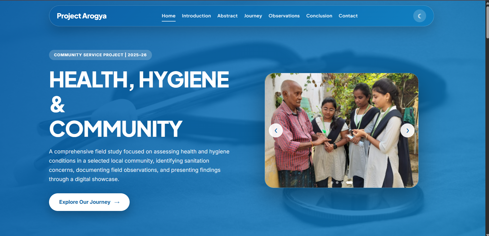
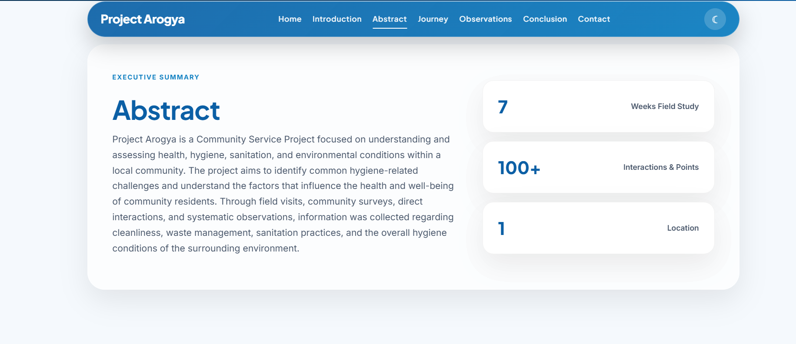
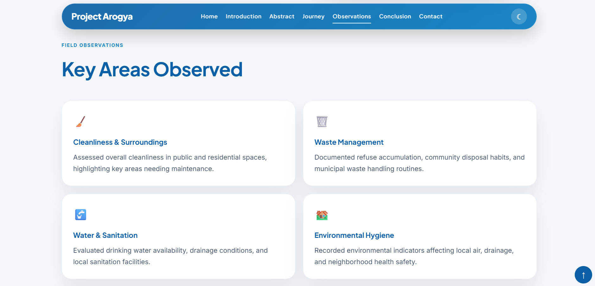
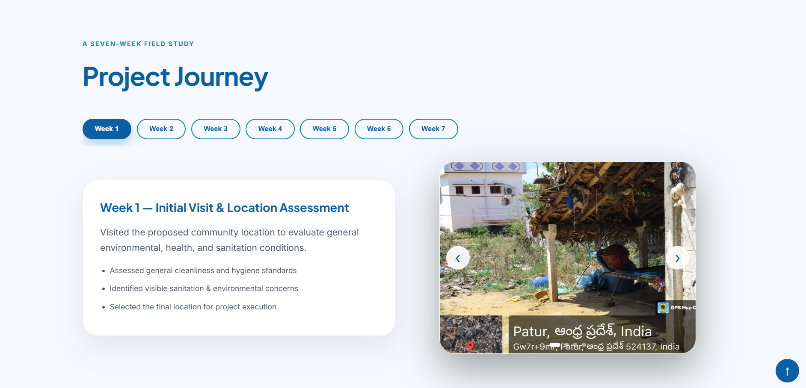

# 🏥 Project Arogya

<p align="center">
  
  
  
  
  
</p>

<p align="center">
  <strong>A modern, fully responsive website showcasing a 7-week Community Service Project (CSP) focused on health, hygiene awareness, field surveys, and community impact.</strong>
</p>

---

## 🌐 Live Demo

🔗 **Website:**  
https://pavanijillella-source.github.io/ProjectArogyaCsp/

---

# 📖 About the Project

Project Arogya is an interactive web showcase created to present the activities, surveys, observations, and outcomes of a seven-week Community Service Project (CSP). The website demonstrates how modern web technologies can be used to effectively document and present community engagement initiatives through a clean, responsive, and visually appealing interface.

The project emphasizes user experience with smooth animations, interactive components, dark/light themes, and a modern glassmorphism-inspired design.

---

# ✨ Features

- 📱 Fully Responsive Mobile-First Design
- 🌙 Dark / Light Theme Toggle
- 💾 Theme Preference Saved with Local Storage
- 🎨 Modern Glassmorphism UI
- 📦 Bento Grid Layout
- 🖼️ Auto Sliding Hero Carousel
- ✨ Smooth Scroll Reveal Animations
- 📅 Interactive 7-Week Project Journey
- 📸 Community Survey Gallery
- 🌊 Animated Conclusion Section
- ⚡ Lightweight & Fast
- 🎯 Semantic HTML5 Structure

---

# 🛠️ Built With

### Languages

- HTML5
- CSS3
- JavaScript (ES6+)

### Concepts Used

- Semantic HTML
- CSS Grid
- Flexbox
- CSS Variables
- Glassmorphism
- Keyframe Animations
- Media Queries
- DOM Manipulation
- Local Storage API

---

# 📸 Project Preview

## 🏠 Home Page



---

## 📄 Project Abstract



---

## 📊 Survey Observations



---

## 📅 Weekly Project Journey



---

# 🚀 Getting Started

## Clone the Repository

```bash
git clone https://github.com/pavanijillella-source/ProjectArogyaCsp.git
```

## Navigate to the Project

```bash
cd ProjectArogyaCsp
```

## Run the Website

Simply open **index.html** in your preferred web browser.

---

# 📂 Project Structure

```
ProjectArogyaCsp/
│
├── index.html
├── style.css
├── script.js
├── images/
├── screenshots/
│   ├── home.png
│   ├── abstract.png
│   ├── observations.png
│   └── weekreport.png
└── README.md
```

---

# 🎯 Project Objectives

- Promote awareness of health and hygiene practices.
- Document field visits and community engagement.
- Present weekly activities in an organized manner.
- Demonstrate modern front-end web development techniques.
- Create an interactive and informative project showcase.

---

# 🔮 Future Enhancements

- 📈 Interactive charts for survey analysis
- ♿ Improved accessibility (WCAG)
- 📊 Analytics dashboard for survey data

---

# 👩‍💻 Author

**Pavani Jillella**

- GitHub: https://github.com/pavanijillella-source
- LinkedIn: https://www.linkedin.com/in/pavanijillella

---

# 📜 License

This project was developed for educational purposes as part of the Community Service Project (CSP).

---

## ⭐ Show Your Support

If you found this project helpful or interesting, consider giving this repository a **⭐ Star** on GitHub!

It motivates continued learning and development.
